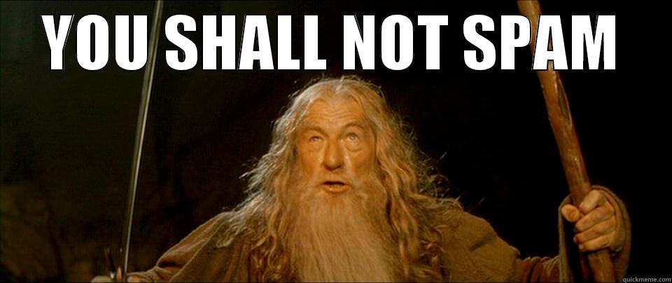

# Spam_detector
Проект по курсу "Технология программирования" в Санкт-Петербургском Политехническом Университете Петра Великого
## Введение. Цель проекта.
Детектирование спама является важной задачей в современном мире, 
так как людей окружает огромное количество информации, в том числе (и довольно часто) ненужной/неинтересной. 
Цель нашего проекта - создать приложение, распознающее спам, а точнее определяющее, на сколько процентов введенное сообщение является им. 

## Сравнение с аналогами

|   Продукт                 |   GUI   |Открытый исходный код | Точность определения|
|:--------------------------|:-------:|:--------------------:|--------------------:|
|[Spam Oborona YandexCleanWeb](http://zixn.ru/plagin-spam-oborona-yandexcleanweb.html)|    да   |          да          |нет данных|
|[DSSPAM](http://www.nuclearelephant.com/)|    да   |          да          | 99.5% - 99.95%|

## Требования к аппаратуре
Spam Detector для рабочего стола Windows

|   Версия       |    Процессор    | Оперативная память | Допольнительное ПО |
|:---------------|:---------------:|:------------------:|-------------------:|
| Windows 10     | Не менее 1 ГГц  |   Не менее 512 МБ  | DirectX 9.0 или    |
| Windows 8.1    |                 |                    | более позней версии|
| Windows 8      |                 |                    |                    |
| Windows 7      |                 |                    |                    |

## Требования к программному обеспечению

На персональном компьютере должны быть установлены:

- Microsoft Windows 7(x86/x64) или более новые версии
- Microsoft Visual C++ 2015 Redistributable Package или более новые версии
- Qt Creator версии 2.0 или более новые версии

Работа на более младших версиях не гарантируется.

## Средства разработки программного обеспечения

Среда разработки:
 * QT Creator 4.5.1
 
Система управления версиями:
 * GitHub

Языки программирования использованные в разработке:
 * средства библиотеки QT 5.10
 * С++ 11 версии
 
Графический интерфейс:
 * QT

Тестирование:
 * QT-unit тесты (версия QT 5.10.0)
 
Средства автоматической генерации документации:
 * doxygen
 
Проверка стиля и синтаксиса итогового продукта:
 * CppCheck Code Analysis Tools версии 1.82.

## Характеристики продукта
*Расход памяти*: 
Приложение потребляет примерно 15.6 МБ памяти (в зависимости от объма файла для обучения).

*Производительность*: 
Приложение обрабатывает сообщение допустимого объема в режиме «обнаружения спама» и в режиме «обучения» за время, которое значительно меньше времени на ввод сообщения.

*Надежность*:
Приложение устойчиво к падениям на больших объемах данных.

*Рыночная ниша*:
Данный проект определенно заинтересует пользователей и разработчиков, которые работают с огромным количеством разной информации. Приложение позволит определять степень "cпамовости" приложения и в случае необходимости отсеивать лишнюю информацию.

## Формат входных данных
На вход в программу может поступать как вводимые пользователем сообщения, так и текстовые файлы,
содержащие некоторый набор символов. Поддерживаемые форматы файлов: .txt.  Ограничение на размер файлов: объем оперативной памяти используемого устройства.
Для того чтобы обучить модель, необходимо нажать кнопку "Обучить детектор", выбрать файл learning/spam.csv или выбрать свой собственный файл формата CSV, в котором данные представлены следующим образом: сначала ключевое слово ham/spam - принадлежность сообщения к соответствующему формату, затем запятая ',' и сам текст сообщения. Например, ham,U can call me now...

## Формат выходных данных
В режиме «обнаружения спама»:
на выходе программы – число в промежутке от 0 до 1 вероятностная оценка введенного сообщения на принадлежность его к спаму (0 – точно не спам, 1 – точно спам).

## Установка продукта
Для того чтобы получить из файла Spam_Detector.pro файл Spam_Detector.vcxproj, необходимо выполнить команду qmake -tp vc Spam_Detector.pro.
Продукт поставляется в исходных кодах. Сборка продукта происходит с помощью CMake.
Для запуска следует выполнить следующие шаги:
* Добавить в переменную окружения PATH путь к директории bin установленного дистрибутива QT
* Открыть текстовый файл по следующему пути относительно корневой директории проекта: <some-prjoect-dir>/test/CMakeLists.txt и изменить строку:
    set(CMAKE_PREFIX_PATH (путь до дистрибутива с QT)).
    Изменив путь на верный путь к директории QT. Путь должен быть до qmake.exe.
* Создать папку с произвольным названием в корневой директории проекта, рядом с папкой src, например, с помощью командной строки:
    mkdir build
* Перейти в созданную папку и выполнить команду создания проекта
  cd build
    cmake -G "Visual Studio 14 2015" ../.
    
Далее необходимо открыть Spam_Detectpr.sln и выполнить сборку стандартным для Visual Studio способом. Для запуска unit-test существует проект, находящийся в папке "test" основного проекта.

## Запуск продукта
Для запуска приложения необходимо открыть графический интерфейс пользователя. Для этого необходимо дважды кликнуть на иконку приложения и дождаться открытия программы. После открытия можно использовать функционал приложения.

## Описание интерфейса пользователя

Интерфейс пользователя состоит из текстового окна, для ввода проверяемых на спам сообщений. 
Кнопка "Получить результат" позволяет оценить введенное сообщение на спам.
Кнопка "Обучить детектор" запускает выбор файла, на основание которого будет произведено обучение алгоритма.
Окно "Результат" служить для вывода результата проверки на спам.
## Описание API библиотеки
|   Модуль       |   Функциональность |
|:---------------| ------------------:|
| GUI     |Интерфейс пользователя, ввод пользователем данных и вывод результата|
| TextClass |Обработка введенных данных, заполнение структур данных|
|Method      |Получение необходимых структур данных, их обработка и получение искомых оценом|
|Автодокументация|Для сборки автодокументации необходимо выполнить команду doxygen DoxygenConfig.|
## Детали реализации
В основе алгоритма лежит Байесовская фильтрация спама. Ба́йесовская фильтра́ция спа́ма — метод для фильтрации спама, основанный на применении наивного байесовского классификатора, опирающегося на прямое использование теоремы Байеса. Теорема Байеса названа в честь её автора Томаса Байеса (1702—1761) — английского математика и священника, который первым предложил использование теоремы для корректировки убеждений, основываясь на обновлённых данных. При обучении фильтра для каждого встреченного в письмах слова высчитывается и сохраняется его «вес» — оценка вероятности того, что письмо с этим словом — спам. Отнесение письма к «спаму» или «не-спаму» производится по тому, превышает ли его «вес» некую планку, заданную пользователем (обычно берут 60-80 %). После принятия решения по письму в базе данных обновляются «веса» для вошедших в него слов.
## Тестирование
Для проверки работы приложения, его модулей и связей между ними были проведены тесты, реализованные с помощью инструмента QTest.
Классы тестов:
* Тест на корректность обработки входных данных (сообщения или данные для обучения).
* Тест на правильность полученного результата на тестовых примерах.
* Стресс-тест на больом количестве данных.

Для проверки кода на стиль и синтаксис были использованы возможности cppcheck.

Для того, чтобы запустить проверку CppCheck, необходимо (для среды QtCreator):

- Загрузить дополнительные библиотеки, позволяющие интегрировать CppCheck, с сайта https://github.com/OneMoreGres/qtc-cppcheck/releases
- Выставить в параметрах запуска CppCheck в QtCreator параметры командной строки --enable=all --language=c++
## Ссылки и литература
* Metsis V., Androutsopoulos I., Paliouras G.  [Spam Filtering with Naive Bayes — Which Naive Bayes?](http://citeseerx.ist.psu.edu/viewdoc/download?doi=10.1.1.61.5542&rep=rep1&type=pdf) // CEAS 2006: Third Conference on Email and Anti-Spam, July 27-28, 2006, Mountain View, California, USA. — 2006.
* [Фильтрация смс спама с помощью наивного байесовского классификатора](https://habrahabr.ru/post/184574/)
* Sahami M., Dumais S., Heckerman D., Horvitz E. [ A Bayesian approach to filtering junk email](http://erichorvitz.com/junkfilter.htm) // AAAI Workshop on Learning for Text Categorization. Technical Report. — 1998.
